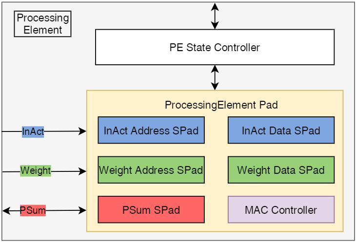
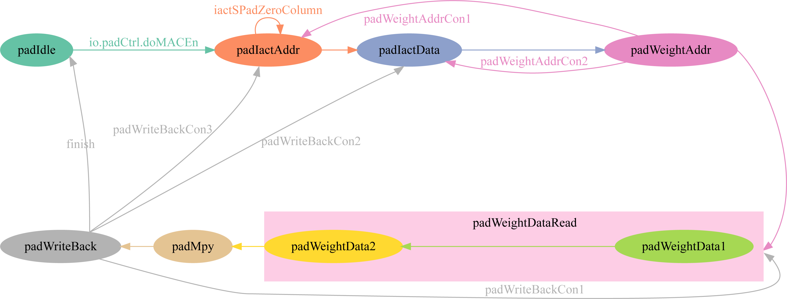
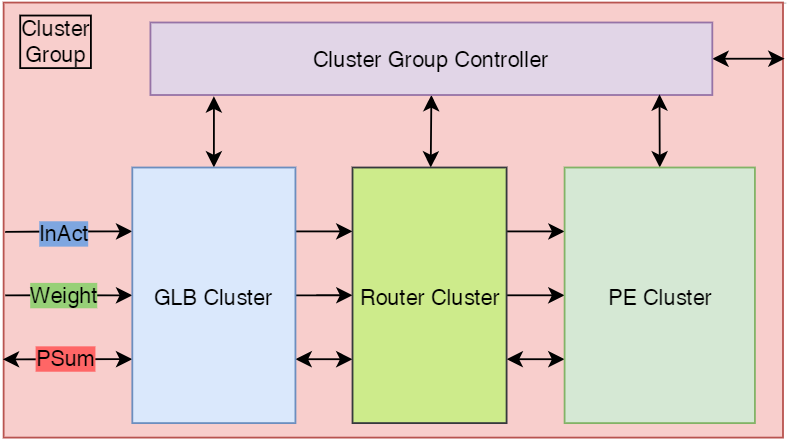
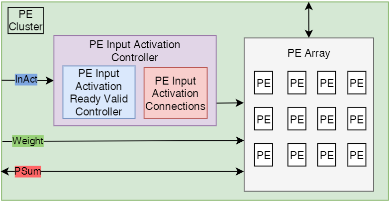
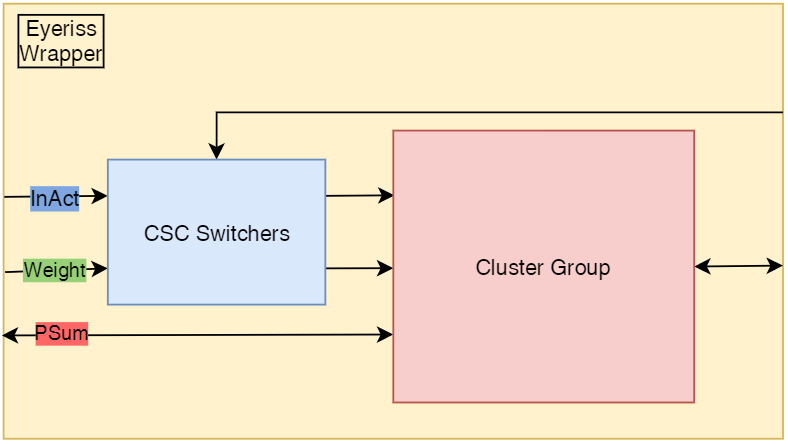
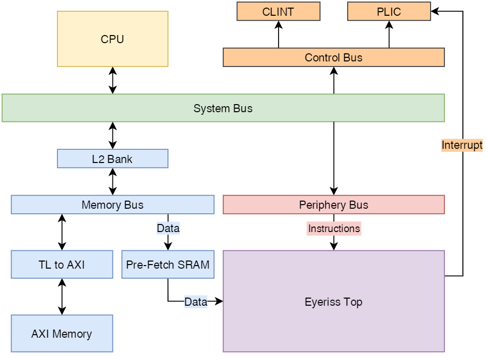
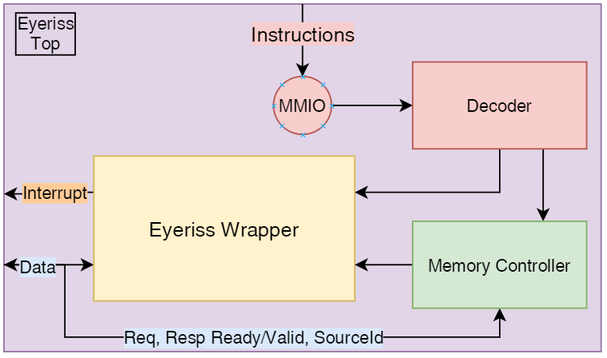
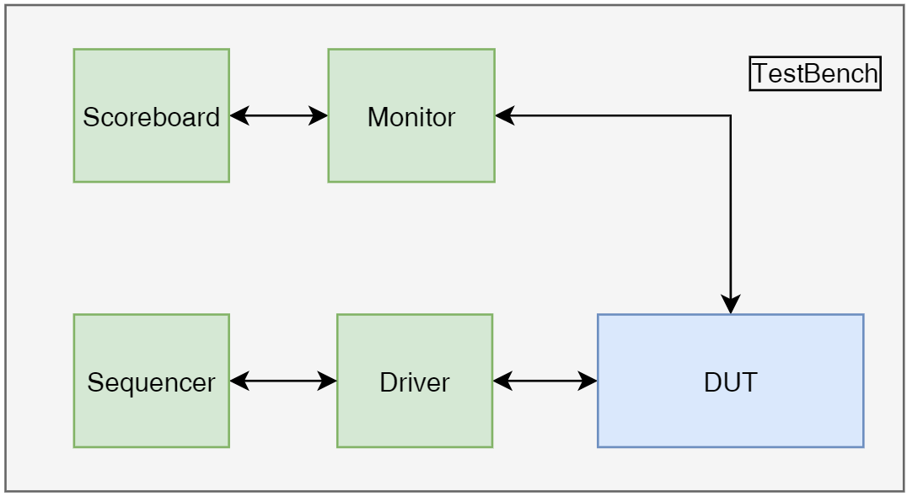

# Deep Learning Accelerator Based On Eyeriss V2 with Extend Custom RISC-V Instructions

This project is a deep learning accelerator implementation in Chisel. The architecture of the accelerator is based on Eyeriss v2.

It can be integrated into Rocket Chip System SoC with extended custom RISC-V instructions.

diagram

## Run

Thanks to [Sequencer](https://github.com/sequencer), 
this project is integrated in [`rocket-playground` environment](https://github.com/sequencer/rocket-playground), 
you can clone the whole environment and run inside, or you can only test the module under `ClusterGroup`.

### Clone Rocket-Playground With This Project

```bash
git clone https://github.com/SingularityKChen/rocket-playground.git --recurse-submodules
cd rocket-chip/
mill mill.scalalib.GenIdea/idea
```

And then you can develop and test this project in Intellij.

### Install Mill

You can install `mill` manual or [other methods](http://www.lihaoyi.com/mill/)

```bash
sudo su
curl -L https://github.com/lihaoyi/mill/releases/download/0.6.1/0.6.1 > /usr/local/bin/mill
chmod +x /usr/local/bin/mill
```

### Generate an IntelliJ Project Config

After cloning it with `--recurse-submodules`, you can use `mill` in idea after this command:

```bash
mill mill.scalalib.GenIdea/idea
```

If you meet any similar error as bellow shows, you can check the `mill` version, and then [install the newest version of `mill`](#Install-Mill).


If your mill can not find some `build.sc` files under `firrtl`, `chisel3`, etc., then you need to clone the submodules as well.

## TODO

You can find it at [the project page](https://github.com/SingularityKChen/dl_accelerator/projects/1).

## Known Bugs

+ Meet continuous zero \(more than three\) columns in weight matrix;
+ The head of address vectors or data vectors is zero column;

## [Modelling](./dla/tests/src/ScalaModelTest.scala)

I tried to write a Scala model for Eyeriss to get the performance. Notice: I use CSC data format not only in scratch pads but also inAct SRAMs.

## [Elaboration](./dla/src)

### [Processing Element](./dla/src/pe)

This is the original fundamental component of deep learning accelerator and the PE in this project is [a little different](#Some-Differences).




At SPad for loops, the row number of the 2D partial sum matrix is `M0`, the column number of it is `F0*N0*E`, the size of partial sum matrix is must less than the size of PSumSPad, which equals to `pSumDataSPadSize`.

The original size of 2D input activation matrix is `(R*C0, F0*N0*E)`, the size of 2D weight matrix is `(M0, R*C0)`. Due to the compressed [data format](#Compressed-Sparse-Column-Data-Format), both input activation matrix and weight matrix can be stored in a smaller SPad.

All three kinds of data are stored in the column's order, i.e., partial sum store the first `M0` elements, then second until `F0*N0*E` elements.


𝑊𝑒𝑖𝑔ℎ𝑡((𝑀0, 𝑅∗𝐶0))∗𝐼𝑛𝐴𝑐𝑡((𝑅∗𝐶0, 𝐹0∗𝑁0∗𝐸))=𝑃𝑆𝑢𝑚((𝑀0, 𝐹0∗𝑁0∗𝐸))

#### Some Differences

The original one use CSC format, but I changed it for convenience. More details can be found [later](#Compressed-Sparse-Column-Data-Format).

#### ProcessingElementControl

This is the control module of PE.

#### ProcessingElementPad

This is the Scratch Pad of input feature map, filter weight and partial sum. It contains seven stages. This module is similar to the graph bellow, expect the FIFOs.


The most complex part is the computation state machine.



#### [Scratch Pad Module](./dla/src/pe/SPadModule.scala)

This file contains the template of Scratch Pad module with simple read and write function.

#### [PEIOs](./dla/src/pe/PEIOs.scala)

This file contains all the IOs we need to use in Processing Element module. Including some sub IOs.

##### PETopDebugIO

This is used for debug at PE top level. It generates two sub IOs to get the signal through from control module and Scratch Pad module.

##### PEControlDebugIO

This is used for monitoring control module to top module.

+ peState: know the state of the state machine, idle, load or calculation;
+ doMACEnDebug: this signal can be seen as the start signal of MAC, so we need to keep an eye on it;

##### PESPadDebugIO

This is used for monitoring Scratch Pad module.

+ inActMatrixData: input activations matrix element;
+ inActMatrixRow: input activations matrix row index;
+ inActMatrixColumn: input activations matrix column index, also the column index of output partial sum;
+ inActAdrInc: true then the index of input activation address vector will increase;
+ inActDataInc: true then the index of input activation data and count vector will increase;
+ inActAdrIdx: the index number of input activation address vector;
+ weightAdrSPadReadOut: this is the current value read from weight address vector;
+ weightMatrixData: weight matrix element;
+ weightMatrixRow: weight matrix row index, also the row index of output partial sum;
+ productResult: `inActMatrixData * weightMatrixData`;
+ pSumLoad: the corresponding partial sum produced previous;
+ pSumResult: `productResult + pSumLoad`;
+ weightAdrInIdx: the weight address vector index;
+ sPadState: the state of Scratch Pad state machine, i.e., MAC process;

#### [PE Config](./dla/src/pe/PEConfig.scala)

This is the config file for PE generator.

##### SPadSizeConfig

Contains the size of five scratch pads.

##### PESizeConfig

Contains some more general configs.

+ weightHeight: the height of weight;
+ ofMapHeight: the height of output feature map (output partial sum);
+ inActDataWidth: input activations data width in scratch pad, it is the combination of 8-bit data vector and its corresponding 4-bit count vector;
+ inActAdrWidth: input activations address width in scratch pad, i.e., the width of address vector element;
+ weightDataWidth:
+ weightAdrWidth:
+ cscDataWidth: compressed sparse column data vector width, used for get the real element of inAct and weight;
+ cscCountWidth: csc count vector width;
+ psDataWidth: data width of partial sum;
+ fifoSize: the size of FIFO;
+ fifoEn: true then generate a PE with FIFOs;
+ ~~commonLenWidth: used for get the length of data vector, address vector.~~
+ ~~weightDataLenWidth: used for get the length of weight data vector;~~
+ inActZeroColumnCode: used for judge whether current inAct column is a zero column, default is the last number it can express;
+ weightZeroColumnCode: used for judge whether current weight column is a zero column, default is the last number it can express;

##### MCRENFConfig

Used for data reuse.


### [Cluster](./dla/src/cluster)

#### [Cluster Group](./dla/src/cluster/ClusterGroup.scala)

This is the top module of cluster group. It contains one GLB cluster, one Router cluster, one PE cluster and the cluster group control module.



#### [GLB Cluster](./dla/src/cluster/GLBCluster.scala)

This is the global buffer cluster module. It contains `inActSRAMNum` input activation SRAM banks, `pSumSRAMNum` partial sum SRAM banks.

##### InActSRAMBank

You need to poke the value of `g2*N2*C2*(F2 + S2) + n2*C2*(F2 + S2) + c2*(F2 + S2) + (f2 + s2)` when reading input activation. Then it will find the real address of input activation's SRAM bank via a lookup table. However, when writing, you don't need to poke any address. It will send back `done` signal to other module when read finishes or write finishes.

##### PSumSRAMBank

You have to poke address into partial sum SRAM banks no matter you want to read or write it. The address will be directly sent to the SRAM, which means it's the address of the SRAM.

#### [PE Cluster](./dla/src/cluster/PECluster.scala)

This is the processing element cluster module. It is a PE Array which contains `peArrayColumnNum` columns and `peArrayRowNum` rows, also it needs a inAct controller to make things tidy.



+ dataPath:
  + inActIO: all the inAct data will be sent to `PEClusterInAct` module and sort them out.
  + weightIO
  + pSumIO
+ ctrlPath: 
  + inActSel
    + inDataSel: true for broad-cast and false for uni-cast
    + outDataSel: when in broad-cast, this signal will determine which port of inAct will be sent broad-cast.
  + pSumSel: 
    + inDataSel: true load PSum from GLB, false load from the southern PE.
    + OutDataSel: is assigned to `DontCare`.
    
##### PEClusterInAct

This class is designed to sort the inAct out. Input `inActRouterNum` inAct Data and come out the sorted inAct data corresponding to each PE, i.e., `peRow` * `peCol`.

#### [Router Cluster](./dla/src/cluster/RouterCluster.scala)

This is the router cluster module. It contains `inActRouterNum` input activations router, `weightRouterNum` weight router, `pSumRouterNum` partial sum router.

Each router cluster not only connects to one GLB cluster, one PE cluster, but also at least one another router cluster.

##### InActRouter

This class is the generator of one input activations router.

- dataPath: 
  - `InIOs(0)`: the input activation comes from its corresponding input activations SRAM bank\(GLB Cluster\);
  - `InIOs(1)`: the input activation comes from its northern inAct router;
  - `InIOs(2)`: the input activation comes from its southern inAct router;
  - `InIOs(3)`: the input activation comes from its horizontal inAct router;
  - `OutIOs(0)`: send the input activation to PE Array;
  - `OutIOs(1)`: send the input activation to northern inAct router;
  - `OutIOs(2)`: send the input activation to southern inAct router;
  - `OutIOs(3)`: send the input activation to horizontal inAct router;
- ctrlPath: 
  - inSelWire: its value enable the corresponding inIOs, i.e., 0 enables `inIOs(0)`
  - outSelWire: routing mode:
    - 0: uni-cast
    - 1: horizontal
    - 2: vertical 
    - 3: broadcast

##### WeightRouter

This class is the generator of one weight router.

- dataPath: 
  - `inIOs(0)`: the weight comes from its corresponding GLB Cluster;
  - `inIOs(1)`: the weight comes from its only horizontal neighboring WeightRouter;
  - `OutIOs(0)`: send the data to its corresponding PE Array row;
  - `OutIOs(1)`: send the data to its only horizontal neighboring WeightRouter;
- ctrlPath
  - inSelWire: false enables `inIOs(0)` and true enables `inIOs(1)`
  - OutSelWire: always send to `outIOs(0)` and this signal be true to enables `outIOs(1)`

##### PSumRouter

This class is the generator of one partial sum router. `inIOs(0)` connects directly to `outIOs(1)`.

- dataPath: 
  - `inIOs(0)`: the output partial sum computed by its corresponding PE Array column;
  - `inIOs(1)`: the partial sum read from its corresponding partial sum SRAM bank;
  - `inIOs(2)`: the partial sum transferred from its northern neighboring PSumRouter;
  - `OutIOs(0)`: send the partial sum to its corresponding PE Array column;
  - `OutIOs(1)`: send the partial sum back to its corresponding partial sum SRAM bank;
  - `OutIOs(2)`: send the partial sum to its southern neighboring PSumRouter;
- ctrlPath: 
  - inSelWire: true for `inIOs(1)` and false for `inIOs(2)`;
  - outSelWire: true for `outIOs(0)` and false for `outIOs(2)`;

#### [Cluster Config](./dla/src/cluster/ClusterConfig.scala)

This file contains some basic static parameters needed in the Cluster Group.

### [EyerissWrapper](./dla/src/eyerissWrapper)

#### [ClusterGroupWrapper](./dla/src/eyerissWrapper/ClusterGroupWrapper.scala)

This module is used to wrap cluster group, as I didn't connect all the cluster groups together. So in the future, if I want to connect them together, then I can simple replace the cluster group with a bigger once inside this wrapper. Also, it contains CSC switchers, which can compress the data.



#### [CSCSwitcher](./dla/src/eyerissWrapper/CSCSwitcher.scala)

This module is used to compress matrix into [optimised CSC data format](#Compressed-Sparse-Column-Data-Format).

+ inData: flipped decoupled IO, this is the uncompressed original data.
+ outData:
  + adrIO: decoupled IO, this is the compressed address vector.
  + dataIO: decoupled IO. this is the compressed data vector and count vector.
+ ctrlPath: input only
  + matrixHeight: the height of one matrix.
  + matrixWidth: the width of one matrix.
  + vectorNum: the number of matrix, as we need `0` to be the ending flag.
  
### [Diplomatic](./dla/src/diplomatic)

When we want to integrate Eyeriss into SoC, then we need some more things. The diagram bellow shows the architecture of Eyeriss SoC.



#### [EyerissTop](./dla/src/diplomatic/EyerissTop.scala)

This module wrap the eyeriss wrapper, the decoder and the memory controller together, then we can verify it as in SoC environment.



#### [EyerissDecoder](./dla/src/diplomatic/EyerissDecoder.scala)

This module can decode the instructions from CPU and outputs some config data and control signals.

+ instruction: input, the instructions from CPU
+ calFin: input, true when pSum load finish
+ valid: output, true at one cycle later after pSum load finish
+ doMacEn: output, true when all config instructions have received, then can begin computing.
+ inActIO: input only
  + starAdr: the start address of input activations
  + reqSize: the number of elements that receive from memory at one time.
+ weightIO: input only
  + starAdr: the start address of weight
  + reqSize: the number of elements that receive from memory at one time.
+ pSumIO:
  + starAdr: input, the start address of partial sum
  + reqSize: input, the number of elements that receive from memory at one time.
  + pSumLoadEn: output, true to load PSum from GLB to memory.

#### [MemCtrl](./dla/src/diplomatic/MemCtrl.scala)

This module is used to control the process of read and write from memory. 
This module can generate the address, sourceId, which are used in TileLink get/put. 
Also, it's able to manage all the source id.

+ inActIO, weightIO, pSumIO:
  + address: output, address of the first element of the current matrix
  + sourceAlloc: decoupled IO, output the source id of current requirement.
  + sourceFree: flipped decoupled IO, input the source id that have received the response.
  + startAdr: input, the start address
  + reqSize: input, the number of elements that receive from memory at one time.
    It should less than the size of the GLB SRAM.

## [Tests](./dla/tests/src)

This directory contains all the test files. When it almost finishes, I found that I can mimic UVM's components, so I changed some tests.



### [PE Test](./dla/tests/src/petest)

This directory contains PE test files.

#### [PE Spec Test](./dla/tests/src/petest/ProcessingElementSpecTest.scala)

This is the main body of PE test, including spec test from the top level to Scratch Pad level.

#### [CSC Format Data R/W Test](./dla/tests/src/petest/SimplyCombineAddrDataSPad.scala)

This is one fundamental scratch pad module to test the read and write with CSC format data.

### [Cluster Tets](./dla/tests/src/clustertest)

This directory contains cluster test files.

#### [ClusterSpecTest](./dla/tests/src/clustertest/ClusterSpecTestBasic.scala)

This is the main body of cluster group test. It contains the tests of PECluster, RouterCluster, GLBCluster and the top of three.

##### [test the spec of GLB Cluster](./dla/tests/src/clustertest/GLBClusterSpecTest.scala)

This behavior contains several tests related to the GLB cluster's spec, i.e., three submodules and top spec.

##### [test the spec of Processing Element Cluster](./dla/tests/src/clustertest/PEClusterSpecTest.scala)

### [diplomatictest](./dla/tests/src/diplomatictest)

#### [EyerissTopSpecTest](./dla/tests/src/diplomatictest/EyerissTopSpecTest.scala)

#### [EyerissDecoderSpecTest](./dla/tests/src/diplomatictest/EyerissDecoderSpecTest.scala)

#### [MemCtrlSpecTest](./dla/tests/src/diplomatictest/MemCtrlSpecTest.scala)

## Instruction Set

### OpCode

As the opcode map of [RISC-V user 2.2](https://github.com/riscv/riscv-isa-manual/blob/riscv-user-2.2/src/opcode-map.tex) shows, 
I choose the custom space of `custom-1`, so the opcode is `01_010_11`.
If I use `RoCC` interface, I have to use the following instructions: 

  | `INSTRUCTIONS` | `funct7` | `rs2` | `rs1` | `xd` \& `xs1` \& `xs2` | `rd`  | `opcode` |
  | -------------- | -------- | ----- | ----- | ---------------------- | ----- | -------- |
  | `LoadPSum` | 0000000 | ????? | ????? | 001                    | ????? | 0101011  |
  | `InActWeiAddr` | 0000001  | ????? | ????? | 110                    | ????? | 0101011  |
  | `G2N2M2F2` | 0000010  | ????? | ????? | 110                    | ????? | 0101011  |
  | `C2S2G1N1` | 0000011  | ????? | ????? | 110                    | ????? | 0101011  |
  | `M1F1C1S1` | 0000100  | ????? | ????? | 110                    | ????? | 0101011  |
  | `F0N0C0M0` | 0000101  | ????? | ????? | 110                    | ????? | 0101011  |
  | `E&R` | 0000110  | ????? | ????? | 110                    | ????? | 0101011  |

However, if I decide to get the configurations and instructions via mapped register, then the instruction set can be more flexible. 
I try to design the instruction set based on **I-type**.

| `INSTRUCTIONS` | `imm[11:0]` | `rs1` | `func3` | `rd` | `opcode`|
| --- | --- | --- | --- | --- | --- |
| `LoadPart0` | `G2N2M2F2` | `inActAdr` | 000 | `weightAdr` | 0101011 |
| `LoadPart1` | `C2S2G1N1` | --- | 001 | --- | 0101011 |
| `LoadPart2` | `M1F1C1S1` | --- | 010 | --- | 0101011 |
| `LoadPart3` | `F0N0C0M0` | `E` | 011 |`R` | 0101011 |
| `LoadPSum` | --- | --- | 100 | `PSumAdr` | 0101011 |

## Data Flow And Data Format

### Row-Stationary Plus \(RS+\) DataFlow

The figure bellow shows the data flow of Row Stationary Plus, and you can find it at ref.3.


And the figure bellow is the data flow of Row Stationary, you will find more information at ref.1.


However, when I tried to map the Row Stationary Plus data flow into a graph like Row Stationary's, 
I found that we are supposed to accumulate each partial sum columns rather than rows, because in RS+, 
we have done each row in SPad Level, i.e., the for loop of `E` and `R`.

So we can get the graphs bellow.

At SPad level, we will calculate all rows of weights and partial sums, so we don't have to care about this dimension at other levels.


At Noc level, all kinds of data will be mapped in to PE array at same time, 
and regard the PEs which will produce the same column of partial sums as one group.


At Global Buffer level, each group we created at Noc level will read in those data.


### Compressed Sparse Column Data Format

Compressed Sparse Column is a data format used to jump zero-element MAC.

The CSC format used in this project is a little different from the original one.


The picture above shows the one used in Eyeriss V2, but in this project it changes.

+ I used Zero Column Code to represent a zero column instead of repeat the value of next address vector element;
+ I used the row number in original matrix instead of the real 'count' vector;

Although it will decrease the size of matrix column with a pseudo-count vector, it is much simpler.

### The Length of Address Vectors and Data Vectors

When we use CSC format data, the length of both address vectors and data vectors are variable. 
So we cannot use the common way to stop reading or writing.

I use one zero `0` to show the end of one vector (one address vector or one data vector with count vector) 
at Scratch Pad level; I use two continuous zero `00` to show the end of one stream of vectors at SRAM bank level.

## Reference

\[1\]V. Sze, Y.-H. Chen, T.-J. Yang, and J. S. Emer, “Efficient Processing of Deep Neural Networks: A Tutorial and Survey,” 
Proc. IEEE, vol. 105, no. 12, pp. 2295–2329, Dec. 2017, doi: 10.1109/JPROC.2017.2761740.

\[2\]Y.-H. Chen, T.-J. Yang, J. Emer, and V. Sze, “Eyeriss v2: A Flexible Accelerator for Emerging Deep Neural Networks 
on Mobile Devices,” arXiv:1807.07928 \[cs\], May 2019.

\[3\]Y.-H. Chen, T.-J. Yang, J. Emer, and V. Sze, “Eyeriss v2: A Flexible and High-Performance Accelerator for 
Emerging Deep Neural Networks,” arXiv:1807.07928 \[cs\], May 2019.

\[4\]Y.-H. Chen, J. Emer, V. Sze, Y.-H. Chen, J. Emer, and V. Sze, “Eyeriss: a spatial architecture for energy-efficient 
dataflow for convolutional neural networks,” ACM SIGARCH Computer Architecture News, vol. 44, no. 3, pp. 367–379, Jun. 2016, doi: 10.1109/ISCA.2016.40.

\[5\]Y.-H. Chen, T. Krishna, J. S. Emer, and V. Sze, “Eyeriss: An Energy-Efficient Reconfigurable Accelerator for 
Deep Convolutional Neural Networks,” IEEE J. Solid-State Circuits, vol. 52, no. 1, pp. 127–138, Jan. 2017, doi: 10.1109/JSSC.2016.2616357.

\[6\] A. Waterman and H. Cook, “Chisel/FIRRTL: Home,” Chisel/FIRRTL, 2019. \[Online\]. 
Available: https://www.chisel-lang.org/. \[Accessed: 30-Nov-2019\].

\[7\] D. Pala, “Design and programming of a coprocessor for a RISC-V architecture,” laurea, Politecnico di Torino, 2017.

\[8\] A. Waterman, “Design of the RISC-V Instruction Set Architecture,” PhD Thesis, EECS Department, University of California, Berkeley, 2016.

\[9\] K. Asanović and D. A. Patterson, “Instruction Sets Should Be Free: The Case For RISC-V,” EECS Department, University of California, 
Berkeley, UCB/EECS-2014-146, Aug. 2014.

\[10\] A. Izraelevitz et al., “Reusability is FIRRTL ground: Hardware construction languages, compiler frameworks, 
and transformations,” in 2017 IEEE/ACM International Conference on Computer-Aided Design (ICCAD), 2017, pp. 209–216, doi: 10.1109/ICCAD.2017.8203780.

\[11\] K. Asanović et al., “The Rocket Chip Generator,” EECS Department, University of California, Berkeley, UCB/EECS-2016-17,